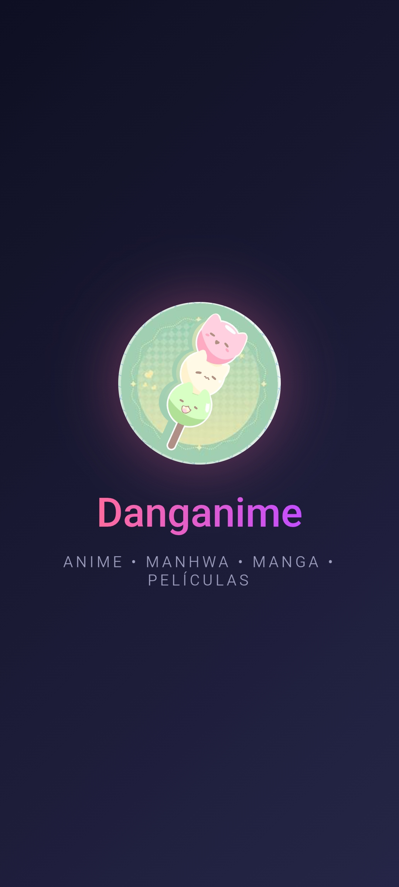
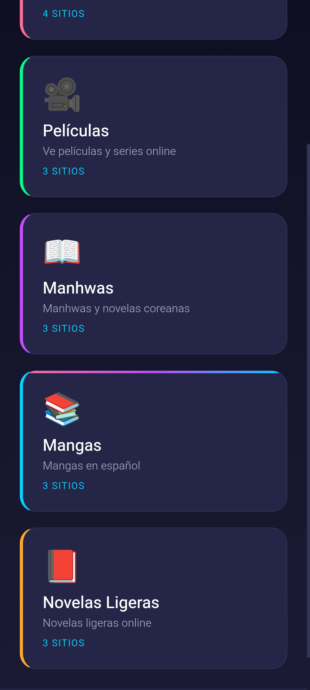
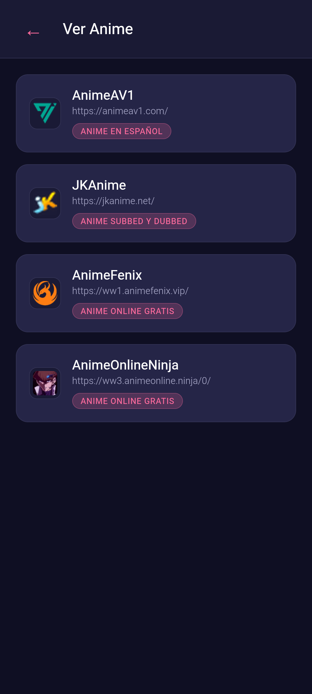

<p align="center">
  
</p>

<h1 align="center">Danganime</h1>

<p align="center">
  <strong>Anime, manhwas, mangas, novelas ligeras y películas en Android — sin anuncios</strong>
</p>

<p align="center">
  
  
  
  
  
  
</p>

---

## Demo

<p align="center">
  
</p>

> Inicio de la app: splash animado con sonido de bienvenida → menú → selector de sitios → navegador.
>
> 🎬 **[Ver demo con sonido (MP4)](screenshots/demo-sound.mp4)**

---

## Capturas

<p align="center">
  
  &nbsp;
  
  &nbsp;
  
  &nbsp;
  
</p>

---

## Qué es

**Danganime** es una aplicación Android que reúne, en una sola interfaz, los mejores
sitios para **ver anime**, **leer manhwas, mangas y novelas ligeras** y **ver películas**,
con un **bloqueador de anuncios** basado en las listas reales de **uBlock Origin**.

Cada sitio se abre como **documento principal** en un **WebView nativo** (no en un iframe),
lo que permite aplicar el bloqueo de anuncios sobre la página real y evita las
restricciones de `X-Frame-Options` / CSP.

- Sin root · Sin cuentas · Sin publicidad · Código abierto

---

## Características

| Característica | Descripción |
|----------------|-------------|
| **Navegador nativo** | Cada sitio se carga a pantalla completa en un WebView propio (top-level) |
| **Bloqueo en 4 capas** | Red (~98.700 dominios), CSS cosmético, JS y guard anti-redirección |
| **Anti-popunder** | Cancela navegaciones a dominios de terceros que intentan sacarte de la página |
| **Secciones** | Anime, Películas, Manhwas, Mangas y Novelas Ligeras |
| **Botón Inicio (🏠)** | Vuelve al menú de la app desde cualquier sitio |
| **Fullscreen** | Modo inmersivo y pantalla completa de vídeo |
| **Sonidos** | Efectos generados con Web Audio + audio de bienvenida |
| **Diseño** | UI con animaciones bounce y colores por categoría |
| **Ligera** | APK de ~7 MB, optimizada para gama baja |
| **Compatible** | Android 5.1+ (minSdk 22, targetSdk 34) |

---

## Cómo funciona

### Navegador nativo
Al tocar un sitio, la app pide al código nativo abrirlo mediante el esquema
`danganime://open?url=...`. `MainActivity` muestra un **WebView a pantalla completa**
(overlay) que carga el sitio como documento principal, con su propia barra
(`🏠 Inicio · ↻ Recargar · ⛶ Pantalla completa · ↗ Abrir externo · × Cerrar`).

### Capa 1 — Red
Cada petición pasa por `shouldInterceptRequest` y se compara por **host exacto**
(con recorte de subdominios) contra ~98.700 dominios de anuncios/trackers derivados de
EasyList, EasyPrivacy y uBlock Origin. Se excluyen CDNs y reproductores legítimos
(`SAFE_BASES`) para no romper vídeos ni librerías.

### Capa 2 — Cosmético (CSS)
Se inyecta un `<style>` (codificado en Base64) con selectores que ocultan contenedores
de anuncios, overlays, popups y avisos anti-adblock.

### Capa 3 — JavaScript
Un script por página bloquea `fetch`/`XMLHttpRequest`, elimina nodos de redes de
anuncios conocidas (`MutationObserver`) y evita `window.open` hacia publicidad.

### Capa 4 — Guard anti-redirección
`shouldOverrideUrlLoading` cancela la navegación top-level hacia dominios de terceros
que no sean de reproductor/sitios permitidos, evitando popunders al pulsar el reproductor.

---

## Secciones y sitios

| Categoría | Sitios |
|-----------|--------|
| **Ver Anime** | AnimeAV1, JKAnime, AnimeFenix, AnimeOnlineNinja |
| **Películas** | Runtime, Pluto TV, Peelink |
| **Manhwas** | ManhwaWeb, ShadeManga, Lector Mangas |
| **Mangas** | SPN Manga, MangaFire, Manga Million |
| **Novelas Ligeras** | Novelas Ligeras, SkyNovels, NextNovels |

> Los sitios son de terceros; la app solo los muestra con bloqueo de anuncios.

---

## Arquitectura

```
Danganime/
├── www/                              # Frontend (HTML/CSS/JS)
│   ├── index.html                    # Splash, menú y selector de sitios
│   ├── css/style.css                 # Estilos y animaciones
│   ├── js/app.js                     # Config de sitios y navegación
│   ├── js/sounds.js                  # Efectos de sonido
│   ├── sounds/welcome.m4a            # Audio de bienvenida
│   └── favicons/                     # Iconos de los sitios
├── android/                          # Proyecto Android (Capacitor)
│   └── app/src/main/
│       ├── java/com/danganime/app/MainActivity.java   # WebView, ad-block, guard, fullscreen
│       └── assets/filters/           # Listas de bloqueo
│           ├── blocked_domains.txt   # ~98.700 dominios
│           └── cosmetic_selectors.txt# Selectores CSS
├── docs/                             # Documentación técnica
├── logs/                             # Changelog por versión
├── apks/                             # APKs por versión
└── capacitor.config.json
```

---

## Instalación

### Opción 1 — Descargar el APK

Ve a la sección [Releases](https://github.com/JonathanDevHurtado/Danganime/releases)
y descarga la última versión. También hay APKs en [`apks/`](apks/).

### Opción 2 — Compilar desde el código fuente

**Requisitos:** Node.js 18+, JDK 17 y Android SDK (compileSdk 34).

```bash
git clone https://github.com/JonathanDevHurtado/Danganime.git
cd Danganime
npm install
npx cap sync android
cd android && ./gradlew assembleDebug
# APK en: android/app/build/outputs/apk/debug/app-debug.apk
```

### Instalar en el teléfono

```bash
adb install -r apks/Danganime-v1.9.3.apk
```

---

## Desarrollo

```bash
# Sincronizar el frontend (www) con el proyecto Android
npx cap sync android

# Compilar el APK de debug
cd android && ./gradlew assembleDebug

# Compilar el APK de release
cd android && ./gradlew assembleRelease
```

El workflow de GitHub Actions
([`.github/workflows/build.yml`](.github/workflows/build.yml)) compila el APK en cada
tag `v*` y publica la release automáticamente.

---

## Listas de filtros

| Lista | Función |
|-------|---------|
| EasyList | Filtros generales de anuncios |
| EasyPrivacy | Protección de privacidad |
| uBlock Origin | Filtros adicionales |
| Listas propias | Redes detectadas (AdAngle, Galaksion, etc.) |

El script [`tools/update_filters.py`](tools/update_filters.py) regenera las listas de
`android/app/src/main/assets/filters/` a partir de las fuentes de uBlock Origin.

---

## Documentación

- [`DOCUMENTACION.md`](DOCUMENTACION.md) — documentación técnica completa.
- [`docs/`](docs/) — documentación por temas (arquitectura, ad-block, fullscreen, build, troubleshooting).
- [`logs/`](logs/) — changelog detallado por versión.

---

## Privacidad

- La app **no envía datos** a servidores propios.
- No hay analíticas ni rastreadores propios.
- Las cookies y sesiones de los sitios se guardan **localmente** en el WebView del
  dispositivo (no se respaldan: `allowBackup="false"`).

---

## Historial de versiones

Resumen; el detalle está en [`CHANGELOG.md`](CHANGELOG.md) y [`logs/`](logs/).

### v1.7.x — Nuevos sitios y verificación
- **10 sitios nuevos** y categoría **Novelas Ligeras**.
- Verificación de **reproducción sin anuncios** en Anime y Películas.
- **Guard anti-redirección** reforzado y CDNs de reproductores permitidos.

### v1.6.x — Rendimiento y reproductores
- Fix del **ANR / lentitud** al iniciar (carga de filtros en segundo plano: 7.9 s → 1.4 s).
- Desbloqueo de reproductores legítimos (JW Player, Streamtape, VK, Vimeo…).

### v1.3.x – v1.5.x — Bloqueo real
- **Navegador nativo** (top-level) en lugar de iframe.
- Bloqueo por **host exacto** (~98.700 dominios) + cosmético + anti-popunder.

### v1.0.0 – v1.2.x — Base
- Splash, menú, selector de sitios, fullscreen, sonidos y primeras listas.

---

## Tecnologías

| Componente | Tecnología |
|------------|------------|
| Frontend | HTML5 · CSS3 · JavaScript (vanilla) |
| Contenedor | Capacitor 6 |
| Nativo | Java (Android SDK) |
| WebView | Chromium del sistema |
| Filtros | Listas de uBlock Origin |
| Build | Gradle + JDK 17 |
| CI | GitHub Actions |

---

## Contribuir

Las contribuciones son bienvenidas:

1. Abre un issue para discutir el cambio.
2. Crea una rama (`git checkout -b feature/nueva-funcionalidad`).
3. Haz commit (`git commit -m 'Agregar nueva funcionalidad'`).
4. Push (`git push origin feature/nueva-funcionalidad`).
5. Abre un Pull Request.

Lee [`CONTRIBUTING.md`](CONTRIBUTING.md) para más detalle.

---

## Licencia

Este proyecto está bajo la licencia **MIT**. Ver [`LICENSE`](LICENSE).

---

## Contacto

- **Autor:** [Jonathan Hurtado](https://github.com/JonathanDevHurtado)
- **Email:** JonathanHurtadoDev@proton.me
- **GitHub:** [@JonathanDevHurtado](https://github.com/JonathanDevHurtado)

---

<p align="center">
  Hecho con HTML, CSS y Java, y pasión por el contenido sin anuncios y optimizado
</p>
